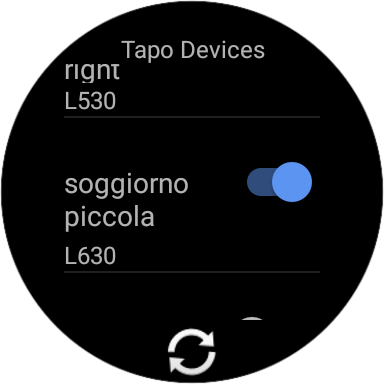

# opentapo-wearos

  

~ Control your Tapo devices from your Smart Watch ~

  <a href="https://opentapo.veeso.dev" target="_blank">Website</a>
  ·
  <a href="#get-started" target="_blank">Installation</a>
  ·
  <a href="https://veeso.dev" target="_blank">About me</a>

Developed by <a href="https://veeso.dev/" target="_blank">@veeso</a>

Current version: 0.2.0 (24/01/2023)

  
  
  
   

---

## About OpenTapo 💡

OpenTapo WearOS is a WearOS app to control your TpLink Tapo plugs and light bulbs.

---

## Features 🎁

- Automatically discovers the devices present on your local WiFi network
- Control all your TAPO devices
  - Set power state
  - Set lamp brightness
  - Set lamp color

---

## Get started 🚀

Get it from [Google Play]()

---

## Support the developer ☕

If you like opentapo-wearos and you're grateful for the work I've done, please consider a little donation 🥳

You can make a donation with one of these platforms:

---

## Contributing and issues 🤝🏻

Contributions, bug reports, new features and questions are welcome! 😉
If you have any question or concern, or you want to suggest a new feature, or you want just want to improve opentapo-wearos, feel free to open an issue or a PR.

An **appreciated** contribution would be a translation of the user manual and readme in **other languages**

Please follow [our contributing guidelines](CONTRIBUTING.md)

---

## Changelog ⏳

View opentapo-wearos's changelog [HERE](CHANGELOG.md)

---

## License 📃

OpenTapo WearOS is licensed under the GNU/GPL3 license.

You can read the entire license [HERE](LICENSE)
